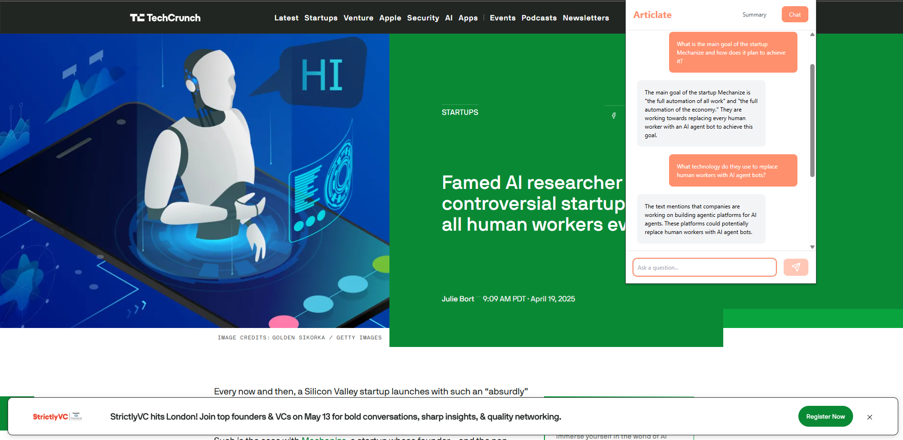

# ChatPDF - Web Content Summarizer

A Next.js application and chrome extension that summarizes web content and provides an interactive chat interface using Azure OpenAI. Built with Next.js and Azure OpenAI, this tool transforms complex web content into digestible summaries and enables interactive Q&A sessions.




## 🚀 Key Features

-   **Smart Content Processing**: Intelligent web content extraction and summarization
-   **Interactive Chat**: Ask follow-up questions about the summarized content
-   **Cost-Optimized**: Efficient implementation using GPT-3.5 Turbo
-   **Enterprise-Ready**:
    -   Smart content extraction
    -   Token usage optimization
    -   Error handling and validation
    -   Session-based chat history

## 💡 Use Cases

-   **Research**: Quickly understand lengthy articles and research papers
-   **Content Analysis**: Extract key points from web content
-   **Information Gathering**: Efficiently process multiple web sources
-   **Knowledge Base**: Create interactive summaries for team sharing

## 🛠️ Technology Stack

-   **Frontend Framework**: Next.js
-   **AI Components**:
    -   Azure OpenAI GPT-3.5 Turbo
    -   Smart content extraction
-   **Deployment**: Vercel-ready
-   **Storage**: Local storage for session management

## ⚙️ Setup

1. Create an Azure OpenAI resource in your Azure account
2. Deploy a GPT-3.5 Turbo model in your Azure OpenAI resource
3. Configure environment variables:

## 🧪 Local Development

1. Install dependencies:

```bash
npm install
```

2. Run the development server:

```bash
npm run dev
```

3. Open [http://localhost:3000](http://localhost:3000) in your browser
